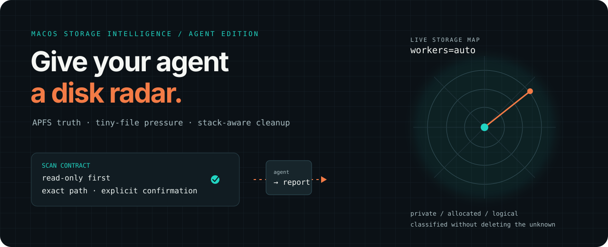
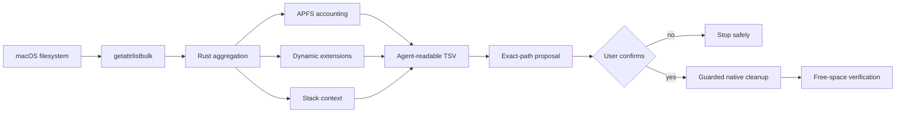

# Reclaim Disk Space

<p align="center">
  
</p>

<p align="center">
  <strong>Give your agent a disk radar.</strong><br>
  Native macOS storage intelligence for the files that normal disk tools miss.
</p>

<p align="center">
  <a href="https://github.com/ferdinandl007/reclaim-disk-space/releases"></a>
  <a href="https://github.com/ferdinandl007/reclaim-disk-space/actions/workflows/ci.yml"></a>
  <a href="https://github.com/ferdinandl007/reclaim-disk-space/blob/main/LICENSE"></a>
  
  
</p>

<p align="center">
  <a href="https://github.com/ferdinandl007/reclaim-disk-space/releases/tag/v0.1.0">Download the arm64 release</a> ·
  <a href="#run-it-with-an-agent">Run it with an agent</a> ·
  <a href="#safety-contract">Read the safety contract</a>
</p>

> Your Mac is not “mysteriously full.” It is usually hiding clones, sparse VM disks, millions of tiny files, model caches, simulator state, editor databases, and build products behind one misleading number. Reclaim Disk Space gives an agent the evidence to tell the difference.

## The one-minute agent loop

```text
discover → explain → propose exact paths → confirm → clean → verify
```

This is not a blind “delete caches” script. It is a macOS-native scanner, an agent-readable skill, and a guarded deletion utility designed to keep destructive decisions visible.

## Run it with an agent

The skill is plain Markdown plus executable tools, so it travels well across agent runtimes. It is native in Codex and can be copied into compatible skill directories for Claude Code, Gemini CLI, Cursor, OpenCode, or a cloud agent running on the Mac whose storage is in scope.

### Give your agent this prompt

```text
Use the reclaim-disk-space skill.

Scan my Mac read-only first. Rank independent storage branches by APFS private bytes
and allocated bytes, explain logical-size distortion, count tiny and small text files,
classify developer/AI/media stacks dynamically, and report permission blind spots.

Do not delete anything. After the report, propose exact canonical paths with risk,
conservative reclaim, regeneration cost, and the owning app. Ask me to confirm exact
paths before any cleanup.
```

### Install the skill in seconds

On Apple Silicon, download the latest archive from [Releases](https://github.com/ferdinandl007/reclaim-disk-space/releases), extract it, and run the included installer:

```sh
./install.sh
```

The release installs prebuilt arm64 tools and the Codex skill. No Rust compiler is required. For a local agent checkout:

```sh
mkdir -p "$HOME/.codex/skills"
cp -R skills/reclaim-disk-space "$HOME/.codex/skills/reclaim-disk-space"
```

## Why agents care

| Agent problem | What this project exposes |
| --- | --- |
| “The disk is full, but the largest files look normal.” | APFS `private`, `allocated`, and `logical` size side by side |
| “The cache says 20 GB, but deleting it freed 2 GB.” | Clone, sparse-file, hard-link, and immediate-reclaim caveats |
| “There are millions of files and every tool crawls.” | Tiny-file, small-file, and small-text hotspots |
| “Classify everything with a brittle extension list.” | Dynamic extension accounting plus contextual stack categories |
| “The user said clean it; what exactly is safe?” | Exact canonical paths, risk tiers, regeneration cost, and confirmation gates |
| “The scan makes the Mac unusable.” | Adaptive workers, process CPU budget, host-load guard, and interactive backoff |

## The safety contract

### Scan first. Delete second.

Scanning is read-only. Cleanup is a separate command and requires the exact canonical path twice. The cleaner refuses `/`, `/System/Volumes/Data`, home directories, relative paths, and cross-filesystem traversal.

```sh
# Read-only plan
skills/reclaim-disk-space/scripts/run-disk-clean.sh \
  --root "$HOME/Library/Developer/Xcode/DerivedData"

# Execute only after reviewing and confirming that exact path
skills/reclaim-disk-space/scripts/run-disk-clean.sh \
  --root "$HOME/Library/Developer/Xcode/DerivedData" \
  --execute \
  --confirm "$HOME/Library/Developer/Xcode/DerivedData" \
  --workers auto \
  --profile interactive
```

The agent must never turn “delete everything” into permission to erase projects, credentials, messages, photos, datasets, model checkpoints, databases, Docker volumes, or synchronized content.

## What the scanner sees



The macOS C shim batches directory metadata through `getattrlistbulk`; Rust handles classification and aggregation without launching a subprocess per file. The same native metadata layer powers the scanner and cleaner.

## A report you can reason about

```text
SUMMARY   private=...   allocated=...   logical=...
          tiny=...     small=...      small_text=...
          workers_best=...  peak_host_busy=...  permission_errors=...

CATEGORY  name=ai_model_weights          private=...
CATEGORY  name=javascript_dependencies   private=...
CATEGORY  name=xcode_simulators_builds   private=...

EXTENSION name=<none>       private=...
EXTENSION name=safetensors  private=...
EXTENSION name=sqlite       private=...

ENVIRONMENT kind=python_venv private=... age_days=... stale_review=true path=/Users/.../project/.venv
ENVIRONMENT kind=conda_env  private=... age_days=... stale_review=true path=/Users/.../miniconda3/envs/old-ai
PROJECT kind=rust_project  private=... age_days=... stale_review=false path=/Users/.../src/tool
PROJECT kind=python_project git_repo=true repository_root=/Users/.../repo project_overlap=true git_branch=main source_files=... generated_files=... source_age_days=... activity_age_days=... stale_review=unknown path=/Users/.../project
GIT_REPOSITORY root=/Users/.../repo branch=main head_oid=... worktree_state=unknown ref_activity_epoch=... index_modified_epoch=... worktree_count=... remote_count=... submodule_count=... metadata_bytes=...
EVIDENCE_SUMMARY environments_total=... projects_total=... git_repositories_total=... version_clusters_total=...
VERSION_CLUSTER key=photo.jpg confidence=high evidence_quality=name+size+created+modified members=4 review_reclaim_private=... suggested_keep=...
VERSION_MEMBER cluster_id=0 version_rank=3 modified_epoch=... path=/Users/.../photo v3.jpg

TOP_PRIVATE       path=/Users/.../Library/Developer/CoreSimulator
SMALL_TEXT_HOTSPOT path=/Users/.../.cache/.../metadata
ERROR_PATH        path=/Users/.../Library/Mail reason=permission
```

The values above are illustrative. Reports are TSV so agents can parse them without a custom API, while humans can still inspect them in a terminal or spreadsheet.

## Built for the real developer Mac

## Measure before tuning

Use the benchmark harness to compare worker counts on a representative tree. It reports elapsed time, metadata throughput, peak resident memory, and incomplete-scan signals:

```sh
scripts/benchmark-scan.sh "$HOME/Library" "1 2 4 8 16 32"
scripts/benchmark-clean.sh "1 2 4 8" 8192
```

Tune against the fastest run that keeps `permission_errors=0` and `partial_directories=0`; maximum worker count is hardware- and filesystem-dependent.
The `make profile ROOT=/path/to/representative/tree` target runs both scanner and guarded-cleaner throughput sweeps and includes peak RSS from macOS process accounting. The benchmark harness explicitly enables `DISK_SCOUT_PROFILE=1` and `DISK_CLEAN_PROFILE=1`; normal scans and cleanups leave those detailed per-operation timers off. Use a disposable copy for the cleaner benchmark because its execute mode removes the fixture.

- **AI:** Hugging Face, model servers, LM Studio, Ollama, PyTorch, Core ML, datasets, embeddings, checkpoints
- **Apple:** Xcode DerivedData, archives, DeviceSupport, SwiftPM, CocoaPods, CoreSimulator devices and runtimes
- **Containers:** Docker Desktop, Colima, Lima sparse disks, images, build cache, volumes, Kubernetes data
- **Languages:** Python/uv/pip/Conda, JavaScript/npm/pnpm/Yarn/Bun, Rust/Cargo, Go, JVM/Gradle/Maven, .NET/NuGet, Ruby, PHP
- **Native and media:** C/C++, CMake, Conan, vcpkg, Android, Blender, Final Cut, Premiere, Resolve, proxies, renders, thumbnails
- **The unknown:** extensionless stores and new formats remain visible in the raw dynamic tables
- **Long-tail waste:** version families, Python/Conda environment inventories, and stale project roots are emitted as agent-readable review records

## Performance without the fan apocalypse

Directory workers are discovered rather than hardcoded. Interactive mode starts conservatively, probes useful concurrency, monitors its own CPU and host load, and backs off when metadata latency or contention rises. Max-throughput mode starts at roughly half the machine’s logical CPU count to avoid wasting a short scan in a one-second warm-up window, then continues probing and can back off if the measured rate deteriorates. The ceiling is derived from logical CPUs, memory, file descriptors, and a generous safety cap, so the same binary can adapt to a different Apple Silicon machine.

GPU acceleration is intentionally not used: filesystem metadata enumeration is kernel/storage bound, while classification is cheap string matching. The useful acceleration is batched native metadata, bounded directory concurrency, hard-link deduplication, and fewer subprocesses.

## Source build

Requirements: Apple Command Line Tools (`clang`), Rust (`rustc`), and an Apple Silicon Mac.

```sh
make build
make test
make scan ROOT="$HOME/Library" OUT=/tmp/library-storage.tsv
make plan ROOT="$HOME/Library/Developer/Xcode/DerivedData"
```

Generated binaries are ignored by Git. Tagged releases publish a prebuilt arm64 archive and SHA-256 checksums through [`.github/workflows/release.yml`](.github/workflows/release.yml).

## Incremental agent checks

```sh
skills/reclaim-disk-space/scripts/incremental-disk-scout.sh \
  "$HOME/Library" \
  /tmp/library-storage-cache
```

The first run records an FSEvents starting point. Later runs reuse the report when nothing changed or print dirty paths for targeted rescans. A dirty or stale cache is never presented as current.

## Limitations worth knowing

- macOS privacy controls and Full Disk Access can hide protected Mail, Messages, Photos, and application data.
- Symbolic links are not followed; mounts on another device are skipped.
- APFS firmlinks, clones, snapshots, and open files can make subtree sums differ from `df`.
- Simulator runtimes, Docker/Colima volumes, editor databases, models, datasets, archives, credentials, and source trees require application-aware review.
- Releases are currently Apple Silicon arm64 only; the source remains available for development and ports.

## Share the radar

If this helped you find the 200 GB your disk graph could not explain, star the project and share the [agent prompt](#give-your-agent-this-prompt). The useful unit of virality here is a reproducible before/after report—not a risky one-line deletion command.

## Development and license

```sh
make build
python3 "${CODEX_HOME:-$HOME/.codex}/skills/.system/skill-creator/scripts/quick_validate.py" skills/reclaim-disk-space
```

See [CONTRIBUTING.md](CONTRIBUTING.md), [SECURITY.md](SECURITY.md), and [LICENSE](LICENSE).
